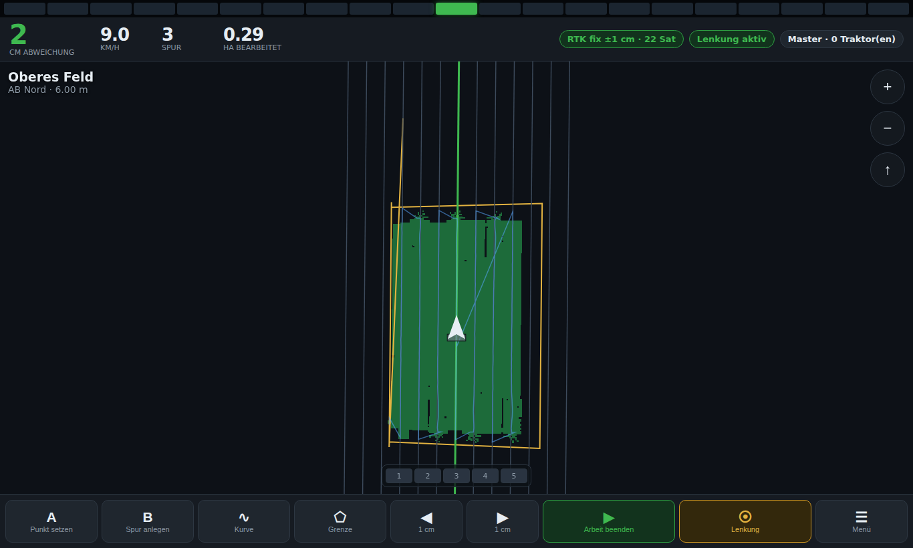

# AgriPilot – GPS-Spurführung für Traktoren

Ein fertiges Lenksystem für den Raspberry Pi: Spurführung mit AB-Linien und
Kurven, Anzeige der bearbeiteten Fläche, Flächenvermessung und Aufzeichnung
aller Fahrten. Ein Pi im Hof ist der **Master**, jeder weitere Traktor ein
**Client** – Felder, Spuren und Korrekturdaten verteilt der Master von selbst.

Bedient wird über den Browser: Tablet, Handy oder Bildschirm am Pi, egal.



## Was es kann

| | |
|---|---|
| **Spurführung** | AB-Linien, A+ (Punkt und Himmelsrichtung), aufgezeichnete Kurven. Lichtbalken und Abweichung in Zentimetern. Spurversatz („Nudge") in 1-cm-Schritten. |
| **Bearbeitete Fläche** | Wird live mitgezeichnet. Hektar, Überlappung in Prozent, Lücken sofort sichtbar. |
| **Sektionen** | Bis zu 24 Teilbreiten, automatisch aus über bereits bearbeitetem Boden und außerhalb der Feldgrenze. |
| **Flächenvermessung** | Feld einmal umfahren – Grenze und Hektar sind gespeichert. |
| **Fahrtenaufzeichnung** | Jede Arbeit mit Datum, Dauer, Strecke, Fläche und Überlappung. Export als GPX, GeoJSON und CSV. |
| **Mehrere Traktoren** | Der Master verteilt Felder und Spuren und gibt die RTK-Korrekturen weiter. Beide sehen, was der andere schon bearbeitet hat. |
| **Lenkautomatik** | Rechnet den Lenkwinkel und gibt ihn an eine Lenkplatine aus – **ab Werk abgeschaltet**, siehe [Sicherheit](#sicherheit). |

## Ehrlich vorweg: woran die Genauigkeit hängt

Die Software rechnet auf den Zentimeter genau. Ob das im Feld ankommt,
entscheidet allein der Empfänger:

| Ausstattung | Wiederholgenauigkeit | Wofür es reicht |
|---|---|---|
| Einfacher GPS-Stick | 2–5 m | gar nichts in der Spurführung |
| GNSS mit SBAS/EGNOS | 0,5–1,5 m | grobe Orientierung, Flächenmessung |
| RTK (z.B. u-blox ZED-F9P + Korrekturdaten) | **2–3 cm** | Spurführung, Sektionen, Lenkautomatik |

Ohne RTK ist alles außer der Fahrtenaufzeichnung und der Flächenmessung nur
eine Orientierungshilfe. Die Einkaufsliste steht in
[docs/HARDWARE.md](docs/HARDWARE.md).

## Schnellstart ohne Hardware

Das System läuft mit einem eingebauten Traktor-Simulator – so lässt sich alles
ansehen und einstellen, bevor ein einziges Kabel verlegt ist:

```bash
cd gps/backend
pip install -r requirements.txt
python3 -m agripilot.server
```

Dann `http://localhost:8080` öffnen. Unter **Menü → System** stehen zwei Regler
für Geschwindigkeit und Lenkung des virtuellen Traktors.

## Auf dem Traktor einrichten

```bash
sudo bash scripts/install_pi.sh master              # Pi im Hof
sudo bash scripts/install_pi.sh client 192.168.10.1 # jeder weitere Traktor
```

Der ganze Weg – vom leeren Pi bis zur ersten Spur – steht Schritt für Schritt in
[docs/INSTALL.md](docs/INSTALL.md). Die Bedienung im Feld erklärt
[docs/BEDIENUNG.md](docs/BEDIENUNG.md).

## Sicherheit

Die Lenkautomatik bewegt eine mehrere Tonnen schwere Maschine. Sie schaltet nur
ein, wenn **alles gleichzeitig** stimmt: in der Konfiguration freigegeben, vom
Fahrer scharf geschaltet, Spur aktiv, RTK-Fix vorhanden, Geschwindigkeit im
zulässigen Bereich, Abweichung unter 1,5 m und die Positionsdaten frisch. Fällt
eine Bedingung weg, geht die Lenkung sofort auf und sagt im Klartext, warum.
Reißt die Verbindung zur Lenkplatine ab, stellt deren Watchdog nach 0,5
Sekunden auf Mitte.

Das ersetzt keinen Not-Aus und keinen Fahrer auf dem Sitz. Auf öffentlichen
Straßen hat die Lenkautomatik nichts zu suchen.

## Aufbau

```
gps/
├── backend/agripilot/
│   ├── geo.py        Projektion in ein lokales Meter-Koordinatensystem, Flächen
│   ├── nmea.py       NMEA-0183-Auswertung, Fix-Qualität, Genauigkeit
│   ├── gnss.py       Empfänger über Seriell/TCP/UDP – und der Simulator
│   ├── ntrip.py      RTK-Korrekturen vom Caster, Weitergabe an die Traktoren
│   ├── guidance.py   AB-Linien, Kurven, Spurabstand, Abweichung, Lenkwinkel
│   ├── coverage.py   Bearbeitete Fläche als Raster, Überlappung, Sektionen
│   ├── steering.py   Lenkbefehl mit allen Sicherheitsbedingungen
│   ├── engine.py     Führt alles zusammen: eine Position rein, ganzes Bild raus
│   ├── storage.py    SQLite: Felder, Spuren, Aufträge, Fahrspuren
│   ├── sync.py       Master/Client-Abgleich, Zusammenführen der Flächen
│   ├── export.py     GPX, GeoJSON, CSV
│   └── server.py     Weboberfläche, Live-Verbindung, Schnittstelle
├── frontend/         Kabinenanzeige (kein Bauschritt nötig)
├── scripts/          Installation, Dienst, Empfänger-Prüfung
└── docs/             Hardware, Installation, Bedienung
```

## Tests

```bash
cd gps/backend && python3 -m unittest discover -s tests -v
```

55 Tests, ohne Zusatzpakete lauffähig. Geprüft wird vor allem, was im Feld Geld
kostet, wenn es falsch ist: Flächen, das Vorzeichen der Abweichung und die
Bedingungen, unter denen die Lenkautomatik einschalten darf.
