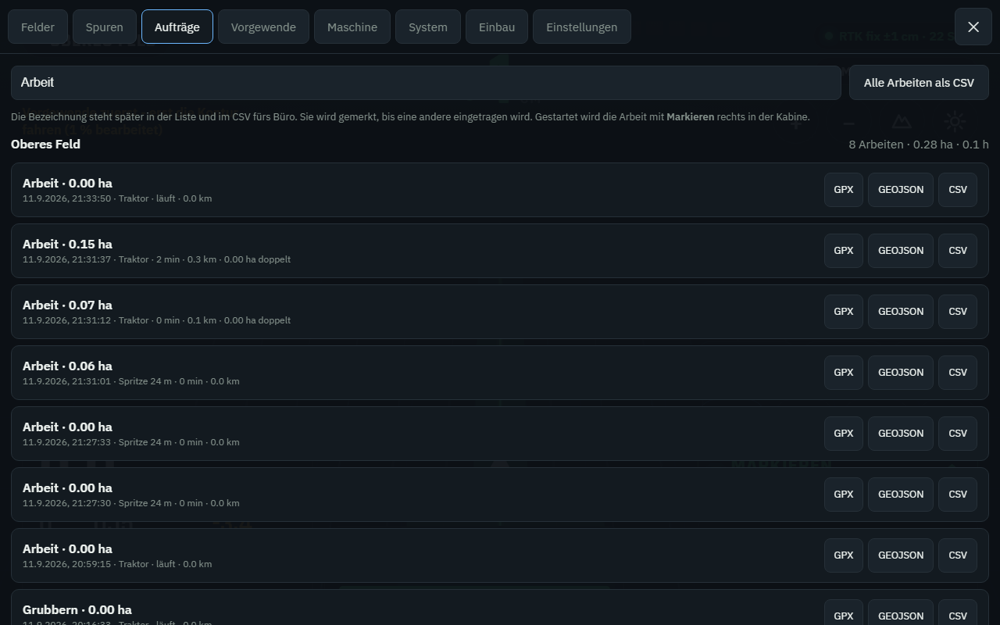

# Bedienung im Feld

## Der Bildschirm

```
 ┌──────────────────────────────────────────────────────────────┐
 │ ▓▓▓▓▓▓▓▓▓░░░░░░░░░░░░░░░░░░░░░░░  Lichtbalken               │
 ├──────────────────────────────────────────────────────────────┤
 │   12      8.4      3      2.41   4.1  [RTK fix ±2 cm]        │
 │ cm ABW.   km/h    SPUR   ha      ° Hang [Lenkung] [Master]   │
 ├──────────────────────────────────────────────────────────────┤
 │ Oberes Feld                                            + − ↑ │
 │ AB Nord · 6,00 m                                             │
 │                                                              │
 │              Karte: bearbeitete Fläche, Spuren,              │
 │              Feldgrenze, Traktor mit Arbeitsbreite           │
 │                                                              │
 │                     [1][2][3][4][5]  Sektionen               │
 ├──────────────────────────────────────────────────────────────┤
 │  A    B    ∿    ⬠    ◀    ▶    Arbeit    Lenkung    Menü    │
 └──────────────────────────────────────────────────────────────┘
```

**Der Lichtbalken ist die eine Anzeige, die man im Augenwinkel lesen kann.**
Leuchtet es rechts, ist der Traktor rechts der Spur – also nach links lenken.
Eine Lampe sind 5 cm. Grün heißt unter 5 cm, gelb bis 20 cm, rot darüber.

Die Zahl links daneben nennt die Abweichung in Zentimetern, die Farbe sagt
dasselbe wie der Balken.



**Der Hang-Wert** erscheint nur, wenn ein Neigungssensor eingerichtet ist. Er
zeigt die Schräglage, und der Ausgleich dazu läuft im Hintergrund: bei 3 m
Antennenhöhe sind 6° Hang 31 cm, um die die Spur sonst wandern würde. Der Wert
färbt sich, sobald der Ausgleich mehr als 15 cm ausmacht – dann arbeitet er
gerade spürbar.

## Ein Feld anlegen und vermessen

1. Auf das Feld fahren, **Menü → Felder**, Namen eingeben, *Feld hier anlegen*.
   Der Bezugspunkt wird an der aktuellen Position gesetzt und ändert sich nie
   wieder – daran hängt, dass zwei Traktoren dieselbe Fläche gleich sehen.
2. **⬠ Grenze** drücken und einmal um das Feld fahren.
3. Am Ausgangspunkt wieder **⬠ Grenze** drücken. Die Fläche in Hektar steht
   sofort da und ist gespeichert.

Die Grenze ist nicht nur Buchhaltung: die Sektionen schalten außerhalb der
Grenze automatisch ab.

## Eine Spur anlegen

**Gerade Spuren (AB-Linie)** – der Normalfall:

1. Am Feldrand in Arbeitsrichtung ausrichten, **A** drücken.
2. Bis zum anderen Ende fahren, **B** drücken.

Fertig. Alle weiteren Spuren liegen im Abstand der Arbeitsbreite parallel dazu.

**A+ – wenn kein Platz für einen B-Punkt ist:** **Menü → Spuren →
*A+ Spur in aktueller Fahrtrichtung***. Die Spur läuft dann genau in die
Richtung, in die der Traktor gerade zeigt. Gut, um die Richtung vom Nachbarfeld
oder vom letzten Jahr zu übernehmen.

**Kurven (Kontur)** – für krumme Felder und Vorgewende: **∿ Kurve** drücken, die
gewünschte Linie abfahren, wieder **∿ Kurve** drücken. Alle weiteren Spuren
folgen dieser Form.

Angelegte Spuren stehen unter **Menü → Spuren** und lassen sich jederzeit wieder
laden.

## Arbeiten

**Arbeit starten** drücken und eintragen, was gemacht wird (Grubbern, Säen,
Spritzen). Ab jetzt:

* wird die bearbeitete Fläche grün mitgezeichnet,
* laufen Hektar, Strecke und Überlappung mit,
* wird die Fahrspur für den Nachweis aufgezeichnet.

Am Ende **Arbeit beenden**. Der Auftrag steht unter **Menü → Aufträge** mit
Datum, Dauer, Strecke, Fläche und doppelt bearbeiteter Fläche – als GPX,
GeoJSON oder CSV herunterladbar. *Alle Arbeiten als CSV* gibt die Liste für das
Büro.

## Spurversatz (Nudge)

Die Tasten **◀** und **▶** verschieben das **ganze Spurmuster** um einen
Zentimeter. Dafür gibt es zwei gute Gründe:

* Zwei Traktoren stehen minimal verschieden auf derselben Spur.
* Nach einer Pause hat sich die RTK-Lösung um ein paar Zentimeter verschoben.

Wichtig: der Versatz verschiebt alle Spuren gleichzeitig, nicht nur die
aktuelle – sonst wäre das Muster nach einer Runde krumm. Er wird beim Feld
gespeichert.

## Sektionen

Bei mehreren Teilbreiten zeigt der Balken unten, welche Sektion offen ist.
Grün = an, grau = automatisch zu, rot = vom Fahrer zugeschaltet.

Automatisch geschlossen wird eine Sektion, wenn sie über bereits bearbeitetes
Land oder über die Feldgrenze hinaus laufen würde. Geprüft wird ein Stück
voraus – je schneller gefahren wird, desto weiter, damit ein Ventil rechtzeitig
schließt.

Antippen schaltet eine Sektion von Hand ab und wieder frei. Die Automatik
insgesamt lässt sich unter **Menü → Maschine** abschalten.

## Lenkautomatik

Nur verfügbar, wenn sie bei der Installation freigegeben wurde.

**Lenkung** drücken schaltet scharf. Sie lenkt erst, wenn alles stimmt:

| Bedingung | Anzeige, wenn sie fehlt |
|---|---|
| in der Konfiguration freigegeben | „in der Konfiguration deaktiviert" |
| vom Fahrer scharf geschaltet | „nicht scharf" |
| Spur geladen | „keine Spur aktiv" |
| RTK-Fix vorhanden | „RTK nötig, aktuell: …" |
| schnell genug | „zu langsam" |
| nicht zu schnell | „zu schnell" |
| näher als 1,5 m an der Spur | „zu weit von der Spur (… m)" |
| Positionsdaten frisch | „GPS-Daten veraltet (… s)" |

**Ins Lenkrad greifen schaltet sofort ab** und die Lenkung bleibt aus, bis sie
neu scharf geschaltet wird. Am Vorgewende wird von Hand gewendet – eine
automatische Wende gibt es bewusst nicht.

## Mit zwei Traktoren auf einem Feld

Beide laden dasselbe Feld (**Menü → Felder → Laden**). Jeder zeichnet seine
eigene Fläche auf; sobald Verbindung zum Master besteht, sieht jeder auch, was
der andere schon bearbeitet hat – und die Sektionen schalten entsprechend ab.

Ohne Verbindung arbeitet jeder Traktor vollständig weiter. Der Abgleich holt
alles nach, sobald der Master wieder erreichbar ist.

## Neigungssensor nullen

Einmal beim Einbau und danach, wenn der Sensor bewegt wurde: auf **ebenem**
Boden **Menü → System → Neigungssensor nullen**. Der Sensor sitzt nie exakt
waagerecht in der Kabine, und ein Grad Montagefehler sind bei 3 m Antennenhöhe
schon 5 cm Dauerversatz in jeder Spur.

Prüfen lässt sich der Ausgleich am besten so: über eine Furche fahren, sodass
der Traktor kippelt. Die angezeigte Abweichung darf dabei fast ruhig bleiben.
Wird sie beim Kippeln größer, arbeitet der Ausgleich verkehrt herum – dann
gehört in die Konfiguration `roll_sign: -1.0`.

## Kleine Regeln, die viel sparen

* **Vor dem ersten Zug prüfen, ob „RTK fix" steht.** Mit „RTK float" wandert die
  Spur über den Tag um Dezimeter, und man sieht es erst an den Streifen im Feld.
* **Arbeitsbreite vor dem Start eintragen.** Sie legt den Spurabstand fest;
  später geändert, passt die schon bearbeitete Fläche nicht mehr dazu.
* **Bei jedem Gerätewechsel die Maße prüfen.** Anbaugeräte haben verschiedene
  Abstände zur Hinterachse.
* **Die Überlappung ehrlich einstellen.** Wer 10 cm Überlappung will, trägt sie
  ein, statt eng zu fahren – dann stimmen auch die Hektarzahlen.
