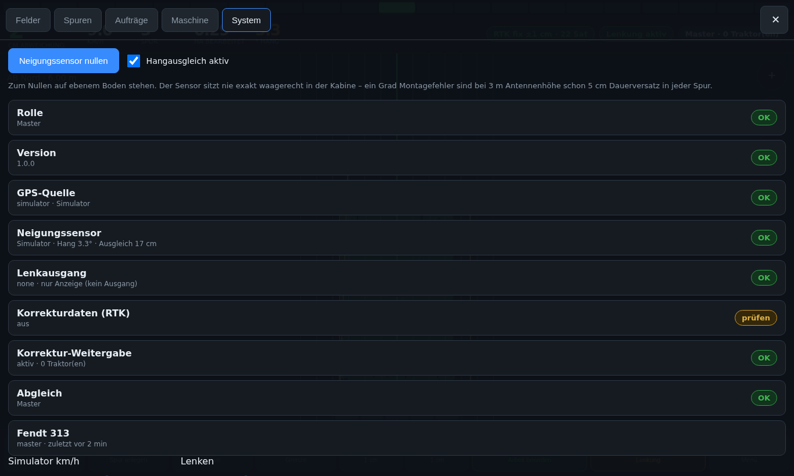

# Installation

> Für die Zusammenstellung aus F9P, Phidget-Motor, IMU Brick und Windows-Tablet
> ist [DEINE_ANLAGE.md](DEINE_ANLAGE.md) der kürzere Weg. Diese Seite beschreibt
> die Einrichtung auf Raspberry Pi allgemein.

Reihenfolge, die sich bewährt: erst am Schreibtisch mit dem Simulator alles
ansehen, dann den Master aufsetzen, dann die Traktoren. Wer mit dem ersten
Traktor anfängt, sucht Fehler an drei Stellen gleichzeitig.

## 1. Am Schreibtisch ausprobieren

Auf jedem Rechner mit Python 3.9 oder neuer:

```bash
cd gps/backend
python3 -m venv venv && source venv/bin/activate
pip install -r requirements.txt
python3 -m agripilot.server
```

Browser auf `http://localhost:8080`. Ohne Konfigurationsdatei startet das
System im Simulator – ein virtueller Traktor mit RTK-Fix fährt los.

Einmal durchspielen:

1. **Menü → Felder**: Namen eingeben, *Feld hier anlegen*.
2. **A** drücken, ein paar Sekunden warten, **B** drücken → erste Spur.
3. **Arbeit starten**, Bezeichnung eintragen. Die bearbeitete Fläche wird grün.
4. **Menü → System**: mit den Reglern lenken und Gas geben.
5. **Menü → Aufträge**: die Fahrt als GPX oder CSV herunterladen.

Damit ist klar, wie sich das System verhält, bevor es im Traktor hängt.

## 2. Master aufsetzen

Der Master ist ein Pi im Hof, der immer läuft. Er kann auch in einem Traktor
sitzen – dann sind aber die Felddaten der anderen nur erreichbar, wenn dieser
Traktor da ist.

**Betriebssystem:** Raspberry Pi OS Lite (64 Bit). SSH beim Schreiben der Karte
im Imager aktivieren, WLAN-Zugang eintragen.

```bash
ssh pi@raspberrypi.local
sudo hostnamectl set-hostname agripilot-master

git clone <dieses-repository> agripilot
cd agripilot/gps
sudo bash scripts/install_pi.sh master
```

Das Skript legt Benutzer und Verzeichnisse an, richtet die Python-Umgebung ein,
schreibt `/etc/agripilot/config.yaml` und startet den Dienst.

**Feste Adresse vergeben** – am saubersten im Router als feste Zuordnung zur
MAC-Adresse, sonst über `/etc/dhcpcd.conf`:

```
interface wlan0
static ip_address=192.168.10.1/24
static routers=192.168.10.254
static domain_name_servers=192.168.10.254
```

**Korrekturquelle eintragen:**

```bash
sudo nano /etc/agripilot/config.yaml
```

Ein Dienst oder eine eigene Basis mit Caster:

```yaml
corrections:
  source: ntrip
  host: ntrip.mein-anbieter.de
  port: 2101
  mountpoint: VRS_3_2G_BY
  username: meinbenutzer
  password: meinpasswort
  send_gga: true       # Netz-RTK braucht die eigene Position
```

Eine eigene Basis, die nur einen Port mit rohem RTCM3 öffnet:

```yaml
corrections:
  source: tcp
  host: 192.168.10.5
  port: 9000
```

Weitere Wege (Funkmodem am Rechner, Modem direkt am Empfänger) und der wichtige
Hinweis zu festen Basiskoordinaten stehen in [HARDWARE.md](HARDWARE.md).

```bash
sudo systemctl restart agripilot
```

Unter **Menü → System** muss danach bei *Korrekturdaten (RTK)* „verbunden"
stehen und die Byte-Zahl steigen.

## 3. Empfänger anschließen

Antenne montieren (siehe [HARDWARE.md](HARDWARE.md)), Empfänger per USB an den
Pi, dann:

```bash
python3 /opt/agripilot/scripts/check_receiver.py
python3 /opt/agripilot/scripts/check_receiver.py /dev/ttyACM0
```

Kommen Positionen an, den Anschluss in die Konfiguration eintragen:

```yaml
gnss:
  source: serial
  port: /dev/ttyACM0
  baudrate: 115200
```

> **Tipp:** `/dev/ttyACM0` kann nach einem Neustart auf `ttyACM1` springen, wenn
> noch etwas anderes am USB hängt. Dauerhaft eindeutig wird es mit einer
> udev-Regel:
>
> ```
> # /etc/udev/rules.d/99-gnss.rules
> SUBSYSTEM=="tty", ATTRS{idVendor}=="1546", SYMLINK+="gnss"
> ```
>
> Danach in der Konfiguration `port: /dev/gnss` eintragen.

## 3b. Auf einem Windows-Tablet statt einem Pi

Das Tablet kann die Rolle des Pi vollständig übernehmen – es hat USB für
Empfänger, Neigungssensor und Motorsteuerung, Bildschirm und Akku. In einer
PowerShell **als Administrator** im Ordner `gps`:

```powershell
powershell -ExecutionPolicy Bypass -File scripts\install_windows.ps1
```

Das Skript legt alles unter `C:\AgriPilot` an, schreibt die Konfiguration nach
`C:\ProgramData\AgriPilot\config.yaml`, gibt Port 8080 in der Firewall frei
(damit andere Tablets mitschauen können) und trägt einen Start beim Anmelden
ein. Anschlüsse und Kanäle ermittelt danach:

```powershell
C:\AgriPilot\venv\Scripts\python.exe C:\AgriPilot\scripts\scan_devices.py
```

## 4. Traktoren aufsetzen

Auf jedem weiteren Pi dasselbe, nur mit der Rolle `client` und der Adresse des
Masters:

```bash
sudo hostnamectl set-hostname traktor-fendt313
sudo bash scripts/install_pi.sh client 192.168.10.1
```

Der Client holt sich danach von selbst:

* **Korrekturdaten** vom Master (Port 2102) – keine eigene SIM-Karte nötig,
* **Felder und Spuren** alle 30 Sekunden,
* und schickt seine eigenen Aufzeichnungen zurück.

Prüfen unter **Menü → System**: *Korrekturdaten* und *Abgleich* müssen grün
sein, und auf dem Master taucht der Traktor in der Geräteliste auf.



## 5. Maschine einmessen

**Menü → Maschine**, für jedes Fahrzeug einmal:

| Feld | Bedeutung |
|---|---|
| Arbeitsbreite | Breite des Anbaugeräts in Metern |
| Überlappung | gewollte Überlappung; verringert den Spurabstand |
| Sektionen | Zahl der schaltbaren Teilbreiten (1, wenn keine) |
| Antenne nach vorn / rechts | gemessen ab Mitte Hinterachse |
| Gerät hinter Achse / seitlich | Lage der Arbeitsebene |
| Radstand | Vorder- zu Hinterachse |
| Max. Lenkeinschlag | mechanische Grenze der Lenkung |
| Lenkschärfe | wie hart auf die Spur zurückgezogen wird; siehe unten |

Die Antennenwerte mit dem Maßband nehmen, nicht schätzen. Ein Fehler von 20 cm
sind 20 cm Versatz in jeder Spur.

## 6. Anzeige in der Kabine

Die Oberfläche ist eine Webseite – kein App-Store, keine Installation:

* **Tablet/Handy:** `http://192.168.10.11:8080` öffnen, im Browsermenü *Zum
  Startbildschirm hinzufügen*. Danach startet sie im Vollbild wie eine App.
* **Bildschirm am Pi:** Raspberry Pi OS mit Desktop, Chromium im Kiosk-Modus
  automatisch starten lassen:

```bash
mkdir -p ~/.config/autostart
cat > ~/.config/autostart/agripilot.desktop <<'DESKTOP'
[Desktop Entry]
Type=Application
Name=AgriPilot
Exec=chromium-browser --kiosk --incognito --noerrdialogs http://localhost:8080
DESKTOP
```

Im Querformat und mit ausgeschaltetem Ruhezustand bedienen.

## 7. Lenkautomatik freigeben (optional)

Erst wenn Lenkmotor, Not-Aus und die Rückmeldung der Platine fertig und geprüft
sind – siehe den Abschnitt zur Lenkautomatik in [HARDWARE.md](HARDWARE.md).

```yaml
steering:
  enabled: true
  output: udp
  host: 192.168.5.9      # Adresse der Lenkplatine
  port: 8888
  require_rtk: true      # ohne RTK-Fix wird nicht gelenkt
  min_speed_ms: 0.3
  max_speed_ms: 8.0
  max_cross_track_m: 1.5
  watchdog_ms: 500
```

Die erste Fahrt auf einer freien Fläche, langsam, mit der Hand am Lenkrad.
Zieht das System zu träge auf die Spur, `Lenkschärfe` (im Menü **Maschine**) in
Schritten von 0,1 erhöhen; pendelt es um die Spur, verringern.

## Betrieb und Wartung

```bash
systemctl status agripilot        # läuft es?
journalctl -u agripilot -f        # Protokoll mitlesen
systemctl restart agripilot       # neu starten
```

**Sicherung.** Alles steckt in einer Datei:

```bash
sudo cp /var/lib/agripilot/agripilot.db /media/usb/agripilot-$(date +%F).db
```

Auf dem Master reicht das für den ganzen Betrieb – die Traktoren gleichen ihre
Daten dorthin ab.

**Aktualisieren.** `install_pi.sh` erneut aufrufen: Programm wird ersetzt,
Konfiguration und Daten bleiben unangetastet.

## Wenn etwas nicht geht

| Bild | Ursache | Abhilfe |
|---|---|---|
| „kein GPS" | Empfänger nicht erkannt | `check_receiver.py`, Anschluss und Baudrate prüfen |
| Fix bleibt „GPS" statt „RTK fix" | keine Korrekturdaten | **System**-Seite ansehen; `corrections.source`, Zugang, Mountpoint, Funkstrecke |
| Alter der Korrekturen steigt | Weg von der Basis abgerissen | Funk oder Netz prüfen; die Byte-Zahl allein täuscht |
| „RTK float" hält sich | schlechte Sicht, zu wenig Satelliten | Antennenplatz prüfen, Basisstation zu weit weg (>30 km) |
| Spur liegt gleichmäßig daneben | Antennenmaße falsch | Werte im Menü **Maschine** nachmessen |
| Lenkung wird nicht scharf | eine Bedingung fehlt | die Anzeige nennt den Grund im Klartext |
| Client ohne Verbindung | Netzwerk oder Adresse | `ping` auf den Master, `master_url` prüfen |
| Anzeige friert ein | Verbindung abgerissen | verbindet sich selbst neu; sonst Seite neu laden |
